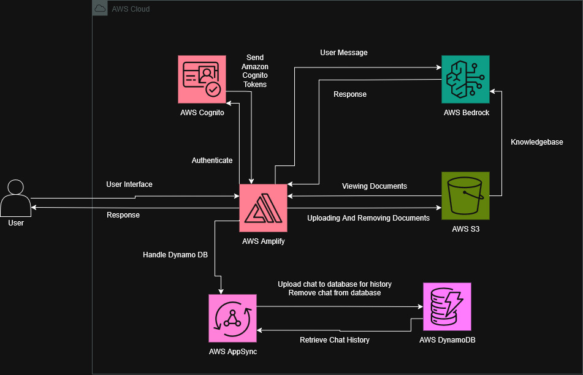

<a id="readme-top"></a>


<!-- PROJECT LOGO -->

<br />
<div align="center">
  <a href="https://github.com/skyfoojs/greataihackathon">
    
  </a>

  <h3 align="center">MediDoc AI</h3>

  <p align="center">
    An AI-Powered Intelligent Medical Document Query Tool!
    <br />
    <br />
    <br />
    <a href="https://youtu.be/uNK7RyhQWnk">View Demo</a>
  </p>
</div>


<!-- TABLE OF CONTENTS -->

<details>
  <summary>Table of Contents</summary>
  <ol>
    <li><a href="#about-the-project">About The Project</a></li>
    <li><a href="#built-with">Built With</a></li>
    <li><a href="#architecture-design">Architecture Design</a></li>
    <li>
      <a href="#getting-started">Getting Started</a>
      <ul>
        <li><a href="#prerequisites">Prerequisites</a></li>
        <li><a href="#installation">Installation</a></li>
      </ul>
    </li>
    <li><a href="#usage">Usage</a></li>
    <li><a href="#license">License</a></li>
    <li><a href="#contacts">Contacts</a></li>
    <li><a href="#acknowledgments">Acknowledgments</a></li>
  </ol>
</details>
<br>


<!-- ABOUT THE PROJECT -->

# About The Project

MediDoc AI is an AI-Powered Intelligent Medical Document Query Tool that aims to help employees in the healthcare industry go through large number of medical documents with ease using queries. This project is made to solve a problem statement provided by the [greataihackathon](https://greataihackathon.com/) and is made by [SkyFoo](https://github.com/skyfoojs) and [iZ86](https://github.com/iZ86).

<p align="right">(<a href="#readme-top">back to top</a>)</p>


# Built With

- [NextJS](https://nextjs.org/)
- [React](https://react.dev/)
- [TypeScript](https://www.typescriptlang.org/)
- [AWS Amplify](https://aws.amazon.com/amplify/)

<p align="right">(<a href="#readme-top">back to top</a>)</p>


# Architecture Design



<p align="right">(<a href="#readme-top">back to top</a>)</p>


<!-- GETTING STARTED -->

# Getting Started

## Prerequisites

### npm

Need npm version (>= 18.x)
  ```sh
  npm install npm@latest -g
  ```

### AWS Account (Optional)

AWS Account with Cognito, Bedrock, Amplify, S3, AppSync and DynamoDB features. However, you can run the program without an AWS Account, but it will not be functional. For example, you can only view the website and navigate through it, without the features of chatting, account creation, etc. To do this, you need to use the noAmplify branch.

### Important Setup Steps for AWS Amplify Sandbox (Skip if no AWS Account)

1. The user needs to have the appropriate AmplifyBackendDeployFullAccess.

### Important Setup Steps for AWS Amplify Deployment (Skip if no AWS Account)

1. The role used to deploy the AWS Amplify needs to have the appropriate S3, CloudFormation, IAM, and Lambda permissions.

<p align="right">(<a href="#readme-top">back to top</a>)</p>


## Installation

1. Clone the repo (Change to noAmplify branch if you do not have an AWS account.)
    ```sh
    git clone https://github.com/skyfoojs/greataihackathon
    ```

2. Install the NPM packages
    ```sh
    npm install
    ```

3. Create environment file (Skip this step if you do not have an AWS account.)
    ```sh
    touch .env
    ```
    
    Contents of .env is:
    ```env
    AGENT_ID=your_agent_id_here
    AGENT_ALIAS_ID=your_agent_alias_id_here

    REGION=us-east-1

    GUARDRAIL_ID=your_guardrail_id_here
    GUARDRAIL_VERSION=your_guardrail_version_here

    MODEL_ID=your_model_id_here
    MODEL_ARN=your_model_arn_here

    KNOWLEDGE_BASE_ID=your_knowledge_base_id_here
    DATA_SOURCE_ID=your_data_source_id_here

    ACCESS_KEY_ID=your_access_key_here
    SECRET_ACCESS_KEY=your_secret_access_key_here
    ```

4. Start the AWS Amplify Sandbox (Skip this step if you do not have an AWS account.)
    ```sh
    npx ampx sandbox
    ```

5. Run the program 
    ```sh
    npm run dev
    ```

<p align="right">(<a href="#readme-top">back to top</a>)</p>


<!-- USAGE -->

# Usage

The video demo on how the system works can be found [here](https://youtu.be/uNK7RyhQWnk).

<p align="right">(<a href="#readme-top">back to top</a>)</p>


<!-- LICENSE -->

# License

Distributed under the MIT License. See LICENSE.txt for more information.

<p align="right">(<a href="#readme-top">back to top</a>)</p>


<!-- CONTACTS -->

# Contacts

SkyFoo - [github](https://github.com/skyfoojs) - [linkedin](https://www.linkedin.com/in/foo-jia-seng-1629112b6/)

iZ86 - [github](https://github.com/iZ86) - [linkedin](https://www.linkedin.com/in/isaac-yeow/)

<p align="right">(<a href="#readme-top">back to top</a>)</p>


<!-- ACKNOWLEGMENTS -->

# Acknowledgments

- [GreatAIHackathon](https://greataihackathon.com/) - hackathon that provided the opportunity to utilize AWS services for this project to be created.

<p align="right">(<a href="#readme-top">back to top</a>)</p>


